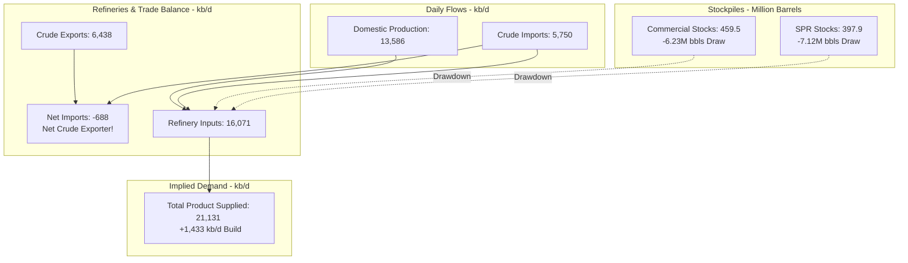

# Weekly Petroleum Status Report (WPSR) Analysis
**Reporting Period:** Week Ending April 24, 2026  
**Publication Date:** May 5, 2026  

This report provides a clear, highly filtered, and easy-to-understand executive summary of the physical flows and stockpiles in the U.S. oil and petroleum markets. The dense, confusing multi-structure layout of the official EIA Weekly Petroleum Status Report (which mixes inventory levels in million barrels and flow rates in thousand barrels per day with conflicting column formats) has been processed and simplified.

---

## 📊 Core Market Highlights

The latest data shows an **extremely bullish, supply-tightening posture** across the U.S. oil complex. Rapidly expanding refinery runs and an unprecedented spike in exports have combined to erode domestic stockpiles at a historic rate.

> [!IMPORTANT]
> **Total Petroleum Inventories (including SPR) collapsed by a massive 24.08 million barrels in a single week**, signaling robust global and domestic physical oil demand.

---

## 📁 Summary Table: Stock Levels (Million Barrels)
Stock levels represent the physical inventories of crude oil and petroleum products stored in refineries, storage tanks, and pipelines. 

| Metric | Current Week   (4/24/26) | Prior Week   (4/17/26) | Weekly Change   (Physical) | Weekly Change   (%) | Year Ago   (4/25/25) | Yearly Change   (%) | Status |
| :--- | :---: | :---: | :---: | :---: | :---: | :---: | :---: |
| **Commercial Crude Oil** | **459.495** | 465.729 | **-6.233** | -1.30% | 440.408 | +4.30% | 🔴 Drawdown |
| **Strategic Petroleum Reserve (SPR)** | **397.924** | 405.045 | **-7.121** | -1.80% | 398.542 | -0.20% | 🔴 Drawdown |
| **Total Crude Stocks (Incl. SPR)** | **857.419** | 870.774 | **-13.354** | -1.50% | 838.950 | +2.20% | 🔴 Drawdown |
| **Total Stocks (Excl. SPR)** | **1,247.188** | 1,264.150 | **-16.962** | -1.30% | 1,212.112 | +2.90% | 🔴 Drawdown |
| **Total Stocks (Incl. SPR)** | **1,645.112** | 1,669.195 | **-24.083** | -1.40% | 1,610.654 | +2.10% | 🔴 Drawdown |

---

## 📈 Summary Table: Daily Flow Rates (Thousand Barrels per Day)
Flow rates represent the speed at which oil is being produced, imported, exported, refined, or consumed on a daily average basis.

| Physical Flow Metric | Current Flow   (4/24/26) | Week Ago   (4/17/26) | Weekly Change   (kb/d) | Year Ago   (4/25/25) | 4-Week Average   (Current) | 4-Week Average   (Year Ago) | Year-Over-Year   4-Wk Change (%) |
| :--- | :---: | :---: | :---: | :---: | :---: | :---: | :---: |
| **Total Crude Production** | **13,586** | 13,585 | **+1** | 13,465 | 13,591 | 13,461 | +1.0% |
| *-- Lower 48 States* | **13,161** | 13,166 | -5 | 13,022 | 13,168 | 13,021 | +1.1% |
| *-- Alaska* | **425** | 419 | +6 | 443 | 423 | 440 | -4.0% |
| **Refinery Crude Inputs** | **16,071** | 15,987 | **+85** | 16,078 | 16,087 | 15,790 | +1.9% |
| **Crude Oil Imports** | **5,750** | 6,078 | **-329** | 5,498 | 5,861 | 5,819 | +0.7% |
| **Crude Oil Exports** | **6,438** | 4,798 | **+1,640** | 4,121 | 5,153 | 4,004 | +28.7% |
| **Net Crude Imports** | **-688** | 1,280 | **-1,969** | 1,377 | 708 | 1,816 | -61.0% |
| **Total Product Supplied (Demand)** | **21,131** | 19,698 | **+1,433** | 19,154 | 20,558 | 19,658 | +4.6% |

---

## 🔍 Key Structural Insights & Market Drivers

### 1. The U.S. Transformed into a Net Crude Exporter
> [!NOTE]
> Net imports of crude dropped into negative territory, hitting **-688,000 b/d**. This means the U.S. sent **688,000 more barrels of crude oil abroad each day** than it imported from international markets.

This transition was driven by a spectacular **1.64 million b/d surge in crude exports** (reaching **6.438 million b/d**) while imports cooled by **329,000 b/d**. This physical outward drain heavily squeezed domestic inventories, drawing down commercial stockpiles by 6.23 million barrels.

### 2. Massive Strategic Petroleum Reserve (SPR) Drawdown
The Strategic Petroleum Reserve saw an unusually large weekly depletion of **7.121 million barrels** (a decline of 1.8% to 397.924 million barrels). This SPR stock change rate indicates an active government drawdown of approximately **1.017 million barrels per day** of SPR crude being fed directly into the domestic refining system, providing buffer supply amidst the red-hot export market.

### 3. Red-Hot Refineries and Consumer Demand
U.S. refineries operated at highly elevated levels, running **16.071 million b/d** of crude through their systems (+85,000 b/d compared to the previous week). 

This operational vigor was matching an explosion in implied product demand:
- **Total Product Supplied (proxy for demand)** skyrocketed by **1.433 million b/d** to hit **21.131 million b/d**.
- Finished Motor Gasoline demand rose to **9.104 million b/d**, while Distillate Fuel Oil demand held strong at **4.113 million b/d**.

---

## 🛠️ Your Custom Interactive Dashboard & Spreadsheet

We have built a state-of-the-art interactive offline-compatible workspace directly in your directory. Here is what has been created for you:

1. **Clean Filtered Spreadsheet (`filtered_crude_oil_data.csv`)**
   - Location: [filtered_crude_oil_data.csv](file:///c:/Users/17169/Desktop/Oil%20data/filtered_crude_oil_data.csv)
   - *What it is:* A perfectly polished spreadsheet file stripped of all non-oil metrics. It divides the data into two highly distinct, logically headers-separated sections: Stock Levels (Million Barrels) and Flow Rates (Thousand Barrels per Day).
   - *How to use:* Open this file directly in Excel, Google Sheets, or your preferred spreadsheet program. It contains no messy formulas, empty sections, or raw footnotes.

2. **Interactive Visual Dashboard (`index.html`)**
   - Location: [index.html](file:///c:/Users/17169/Desktop/Oil%20data/index.html)
   - *What it is:* A custom, premium single-page web application featuring high-fidelity dark mode styling, glassy glassmorphism cards, glowing status badges, and interactive Chart.js visualizations.
   - *How to use:* Simply **double-click** the `index.html` file in your `Oil data` folder. It will load in your browser immediately. It is completely client-side and offline-compatible. You can switch between "Executive Insights", "Inventories", "Daily Flows", and a search-enabled "Master Filtered Table", and export clean CSVs dynamically with a single click.

3. **Data Pipeline Automation Scripts**
   - **`process_oil_data.py`** [process_oil_data.py](file:///c:/Users/17169/Desktop/Oil%20data/process_oil_data.py): The Python script that parses the dense raw `table1.csv` from the EIA, handles encoding safety, applies filters, and saves the formatted files.
   - **`build_dashboard.py`** [build_dashboard.py](file:///c:/Users/17169/Desktop/Oil%20data/build_dashboard.py): The script that compiles the dashboard UI with the processed data.
   - *Note:* If you download a new `table1.csv` from the EIA in future weeks, simply drop it into this folder and run `python process_oil_data.py && python build_dashboard.py` to update your interactive dashboard instantly!
